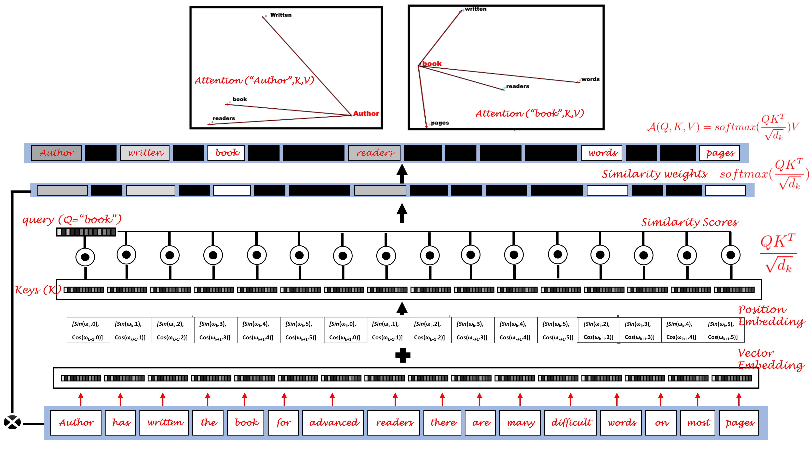

# Attention Matters: What is Attention and How to Compute Attention in a Transformer Model
## A comprehensive and easy guide to Attention in Transformer Models (with example code)

## Requirements

* Python 3
* Spacy
* scipy
* scikit-learn

## Running The Notebook

* Open the Notebook in Google Colab or local jupyter server
* Install the requirements
* Restart the kernel if necessary 

## The tutorial 📃

The full tutorial is available on following links:

On Medium:

https://azad-wolf.medium.com/

On Substack:

https://azadwolf.substack.com/

## References 

[1] L. Itti , C. Koch, “Computational modelling of visual attention”, Nature Reviews Neuroscience volume 2, pages 194–203, 2001
[2] Ashish Vaswani, Noam Shazeer, Niki Parmar, Jakob Uszkoreit, Llion Jones, Aidan N. Gomez, Lukasz Kaiser, Illia Polosukhin, “Attention Is All You Need”, arXiv:1706.03762 [cs.CL], 2017

